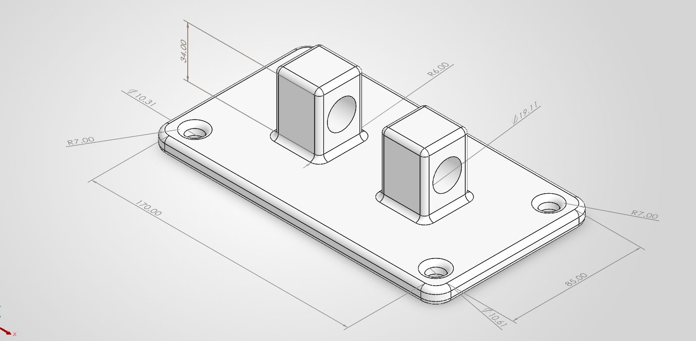
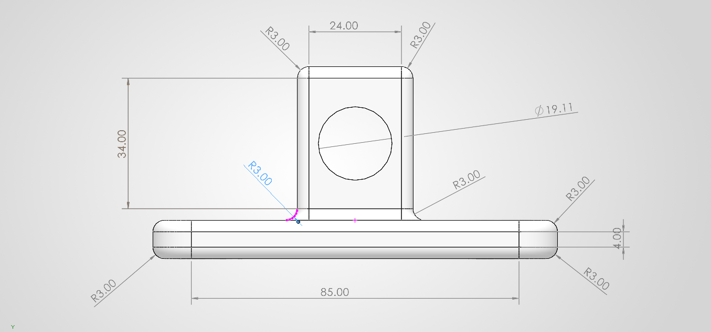

# GE-Jet-Engine-bracket-topology-optimization
GrabCAD challenge — reconstructed jet engine bracket geometry, ANSYS mesh convergence study, SIMP-based topology optimization.
# GE Jet Engine Bracket — Topology Optimization

Reconstruction and structural validation of GE's jet engine bracket challenge (GrabCAD, 2013), including a mesh sensitivity study that surfaced a non-converging stress feature. Topology optimization for weight reduction is scoped and set up; the optimizer run itself is the current next step.

**Material:** Ti-6Al-4V, 903 MPa yield (per GE challenge spec)
**Tools:** SolidWorks, CATIA, ANSYS Mechanical 2025 R2, ANSYS Topology Optimization
 
 

---

## Problem

The bracket clevis-pins to the jet engine at Interface 1 and bolts to the aircraft pylon/strut at Interfaces 2–5. GE's original challenge STEP file is no longer public, so the geometry (V2 baseline) was reconstructed from the published envelope, interface locations, and load cases:

| Case | Type | Magnitude | Direction |
|---|---|---|---|
| LC1 | Static, vertical | 35,586 N | Vertical |
| LC2 | Static, horizontal | 37,810 N | Horizontal, out |
| LC3 | Static, resultant | 42,258 N | 42° from vertical |
| LC4 | Torsional | 564,924 N·mm | About pin centerline |

Target: FOS ≥ 1.5 on yield under each load case individually (per the challenge's Phase I criteria), while minimizing mass.

## Baseline design (V2)

V1 had a sharp, unfilleted boss-to-base corner that produced a classic non-converging stress singularity under mesh refinement. V2's fix: systematic 3 mm (R3) fillets at every boss-to-base and boss-to-boss transition.

## Mesh sensitivity study

| Mesh Level | Size (mm) | Elements | Max Stress (MPa) | FOS | % Change |
|---|---|---|---|---|---|
| Coarse | 8 | 5,614 | 295.09 | 3.06 | — |
| Medium | 4 | 34,329 | 239.55 | 3.77 | −18.8% |
| Fine | 2 | 209,369 | 317.20 | 2.85 | +32.4% |
| Face Sizing (0.5/1.5) | — | 473,537 | 348.62 | 2.59 | +9.9% |

**Finding:** even with the larger V2 fillet, peak stress does not converge monotonically. The dip-then-rise pattern persisted when the fillet was enlarged to 4 mm (≈280/260/310/323 MPa) and a Hex Dominant mesh failed to complete after four attempts — consistent with a locally mesh-sensitive feature at the boss-to-boss inner corner, not a modeling defect (a SolidWorks geometry check found only a 5-micron B-rep tolerance gap there). Following the same practical-baseline approach used for V1, the 473,537-element Face Sizing mesh is reported as the V2 baseline, with this limitation carried forward rather than treated as resolved.

## Baseline results (LC1, final mesh)

| Metric | Value | Location |
|---|---|---|
| Max von Mises Stress | 348.62 MPa | Boss-to-boss inner corner |
| Max Deflection | 0.1734 mm | Top face, unloaded boss tower |
| Minimum FOS | 2.59 | Same location as max stress |
| Mass | 1.094 kg | — |

## Topology optimization — status

Design region, exclusion zones (bolt holes, clevis bore), and objective are scoped in the report; the optimizer has not yet been run. This is the active next step, followed by a manufacturability redesign and validation FEA on the optimized geometry.
```

## Status
🟢 Baseline design & mesh sensitivity study complete · 🟡 Topology optimization run pending
